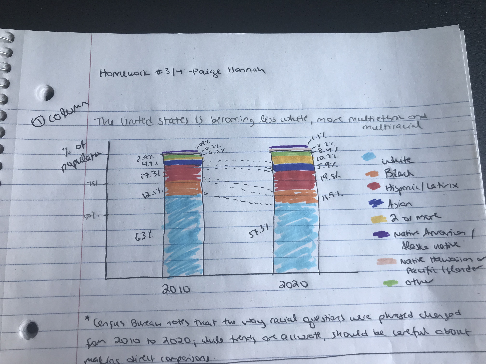
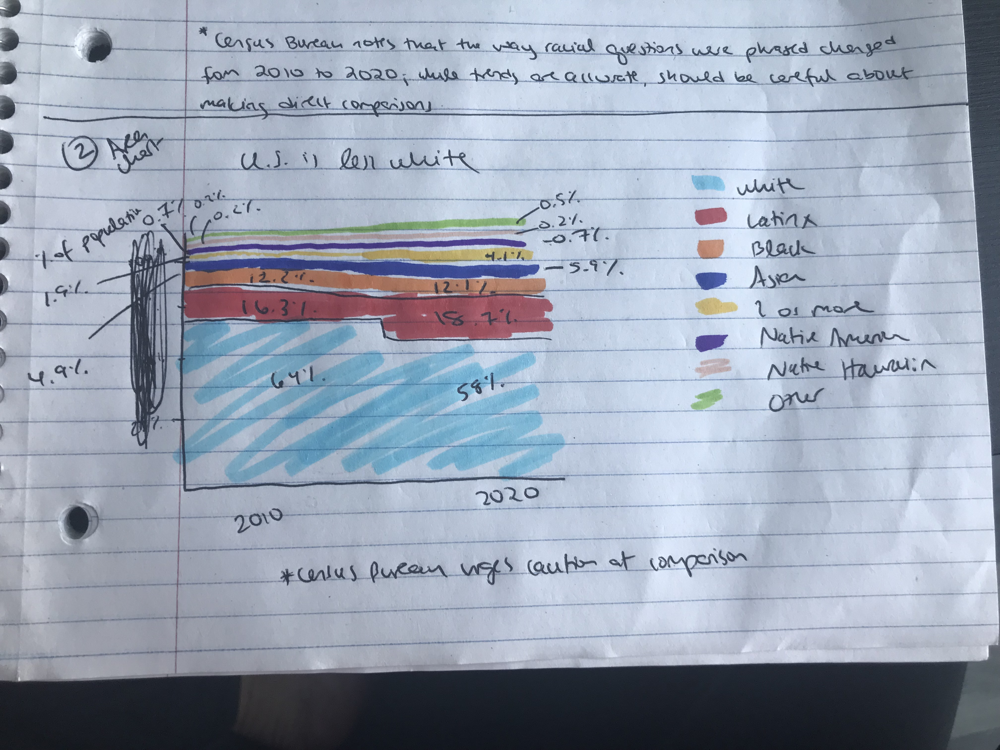
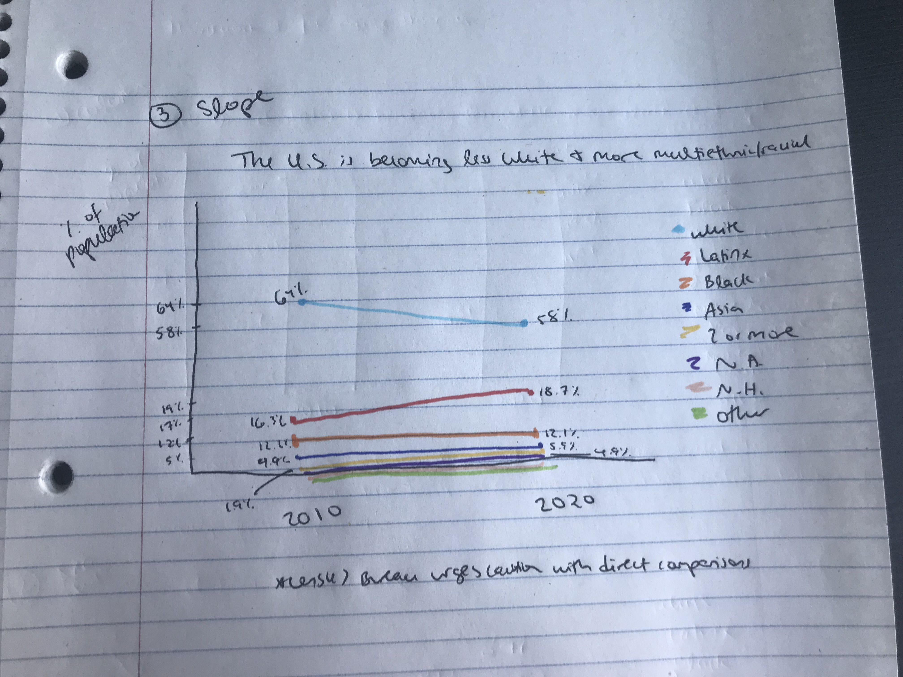

# Assignment 3 & 4: Critique by Design

## Part 1: Find a visualization
I selected the chart titled "The United States is becoming less White, more multiethnic and multiracial" from a CNN article on the 2020 Census Bureau results. Here is the link to the article: 

<https://www.cnn.com/2021/08/12/politics/us-census-2020-data/index.html>

## Part 2: Critique the visualization
This part was already completed and submitted via Google forms

## Part 3: Wireframe a solution
I put together three different versions of the chart: a column chart, an area chart, and a slope chart. I showed #1, the column chart, primarily during part 4 (the testing phase).

### Wireframe 1: Column chart

### Wireframe 2: Area chart

### Wireframe 3: Slope chart

## Part 4: Test the solution
There are 5 questions that I asked two different people:
1. Can you describe what this chart is telling you?
2. Is there anything you find surprising or confusing?
3. Is there anything you would do differently?
4. Who do you think the intended audience is?
5. I then showed them my two alternative wireframes, and asked which version they preferred.

Both of my interviewees were easily able to interpret the chart - within a few seconds, they knew that it was showing the change in U.S. population from 2010 to 2020 by race. They also both found it difficult to see the relative changes in some of the smaller categories. It was obvious to them that the portion of Americans who identify as white was decreasing, but it was hard for them to quickly tell where the increase was coming from. This makes sense to me - it is what I did not like about the original chart, and it's something that I struggled to fix during my wireframing.

One of my interviewees would change a few of the design choices - including more tick marks on the y-axis and making sure the legend has the same order of colors as the bars do. The other interviewee suggested that a pie chart would be better than a bar chart to show the changes in the nonwhite portions of the population between 2010 and 2020. That same interviewee also pointed out that they knew that "2 or more races" was a category that was asked in a new way - which made me realize that they had not read my asterisk at the bottom of the chart.

Finally, I showed them the area chart and the slope charts as well. My first interviewee thought that the area chart was better but would still prefer a pie chart. They liked the slope chart for seeing the bigger changes, but they did not think it was easier to see the smaller categories. My second interviewee definitely preferred the slope chart - they appreciated how clean the design was and how easy it was to interpret. I overall did expect the feedback I received from my interviewees (i.e., the difficulty in quickly communicating changes in the smaller categories from 2010 to 2020), but I found their specific suggestions to be quite useful and illuminating. Going into the final step, I planned on creating an area chart and implementing some of their other smaller suggestions.

## Part 5: Build your solution
Ultimately, I decided to create a XXX chart using Tableau. I feel that the final version addressed some of the major issues I had with the original visualization and made it easier to see changes in some of the smaller categories of race/ethnicity.

