# **Final Project**: Credit scores are holding back future small business owners

## Overview of topic selection
One of the policy areas I'm most passionate about is financial inclusion - in other words, making sure that everyone has equitable access to affordable financial tools and resources. Credit scores are a critical gatekeeping mechanism that enables some people to have access to lots of safe financial tools at low cost. However, credit scores are also used to keep many people from accessing these tools - especially potential small business owners. With this presentation, my goal is for my audience to develop an understanding of (American) credit scores, why they are inequitable, the importance of small business owners being able to access capital, and actionable next steps to improve the situation. This is an incredibly important topic that I do not believe gets enough airtime and can benefit from data visualization to make the topic more accessible to all Americans.

I also wanted to share a bit more context about what lead me to consider this as my topic for the final project. This past summer, I interned at the Rockefeller Foundation as part of the Equity and Economic Opportunity team. The team's overarching goal was to decrease the racial wealth gap by improving acccess to capital for Black and Latinx business owners. One of the underlying assumptions of the team members was that since lending gatekeeping mechanisms like credit scores disporportionately negatively affect Black and Latinx individuals, credit scores should be not considered (or minimally considered) when banks and other organizations make loan decisions. I recently shared some of these insights with another class this mini, and I realized that the story behind WHY credit scores are racist and don't belong in loan decisions is not widely known. Therefore, I decided to make it the subject of my final presentation.

## Outline
I. **Introduction** - The goal of this section is for the audience to develop an understanding of what credit scores are, why they are important, and the thesis of the presentation: that credit scores should no longer be used for determing whether individuals should receive small business loans.

- Introduce credit scores - explain what they are, what they are used for, and what affects people's credit scores
- Many Americans do not have good credit scores or are "credit invisible"
- People of color are disproportionately hurt by the status quo
- How credit scores affect individuals' abilities to get small business loans
- This presentation will focus on how it affects your ability to start or expand a small business, and argues that credit scores should no longer be used for determining whether individuals should receive small business loans

II. **Analysis** - The goal of this section is for the audience to consider how important small businesses are to the nation's economy, and how factors unrelated to business success pull down credit scores (and therefore reduce an individual's ability to get loans to start and expand businesses).

- Minorities are disproportionately disadvantaged by credit scores, and they also own a disproportionately small number of businesses
- This has real-world impacts on the U.S. economy
- People have low credit scores for many reasons that are unrelated to their ability to run a successful business and their ability to repay their loans
- Ex: student loan payments
- Ex: medical bills
- Ex: credit card bills

III. **Recommendation** - The goal of this section is to provide a clear alternative option to using credit scores for small business loan decisions.
- Base loan decisions off an analysis of business viability

IV. **Conclusion** - The goal of this section is to give the call to action - I want the audience to immediate start educating their networks and supporting worthwhile organizations addressing this issue.
- The status quo is failing individuals and our country. You can make a difference!
- Here are the next steps you should take: spread the word (educate yourself, your family, your friends, and your community)
- Support organizations helping change the status quo

## Initial sketches
### Introduction

#### Sketch 1
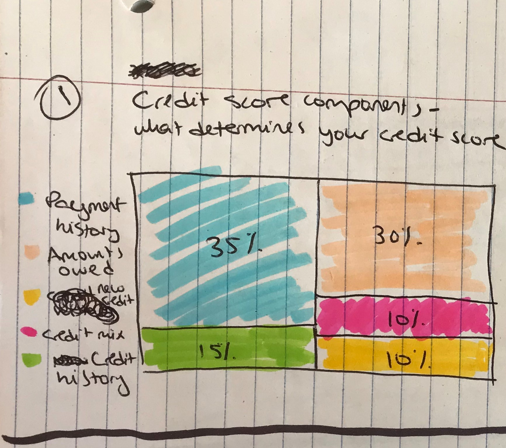

#### Sketch 2
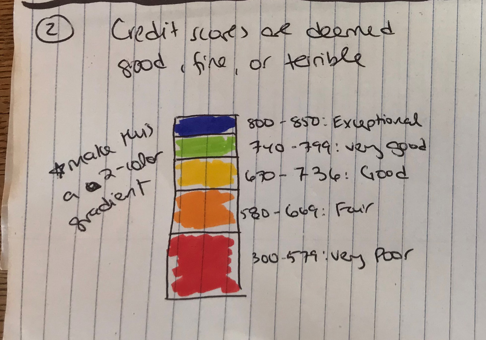

#### Sketch 3
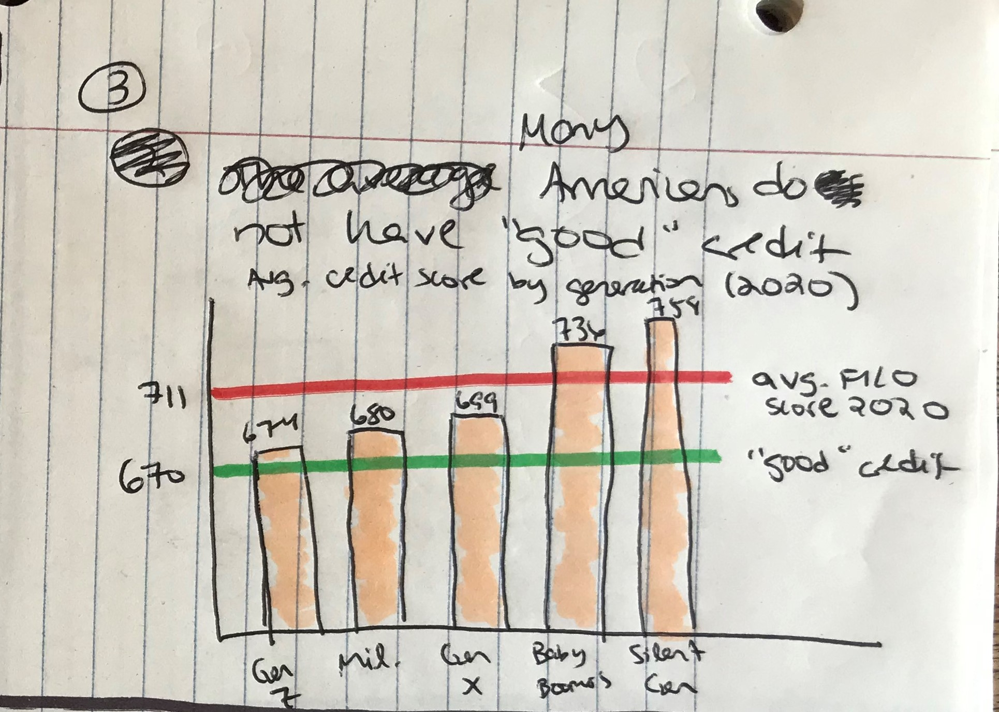

#### Sketch 4
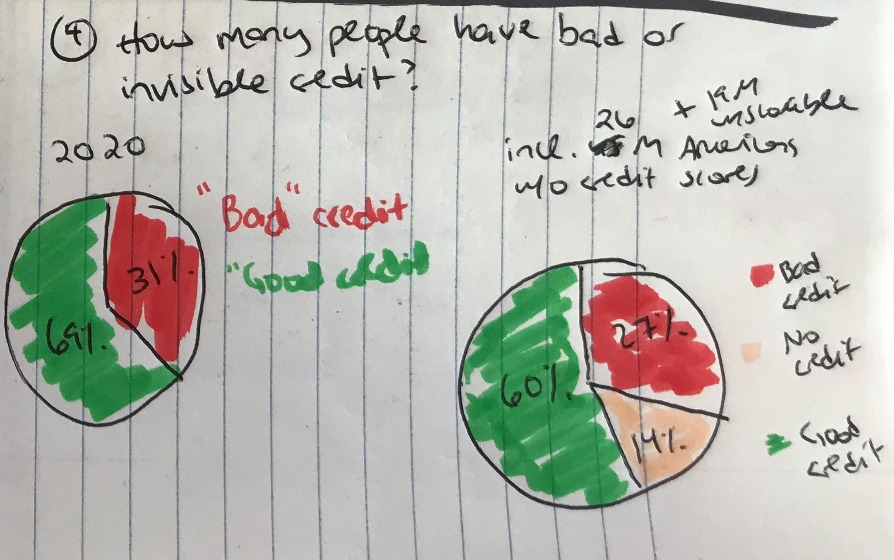

#### Sketch 5
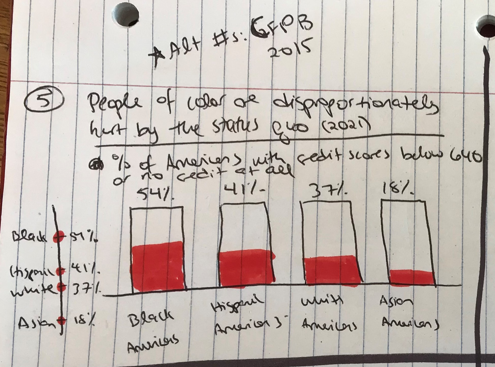

### Analysis - small businesses
#### Sketch 6
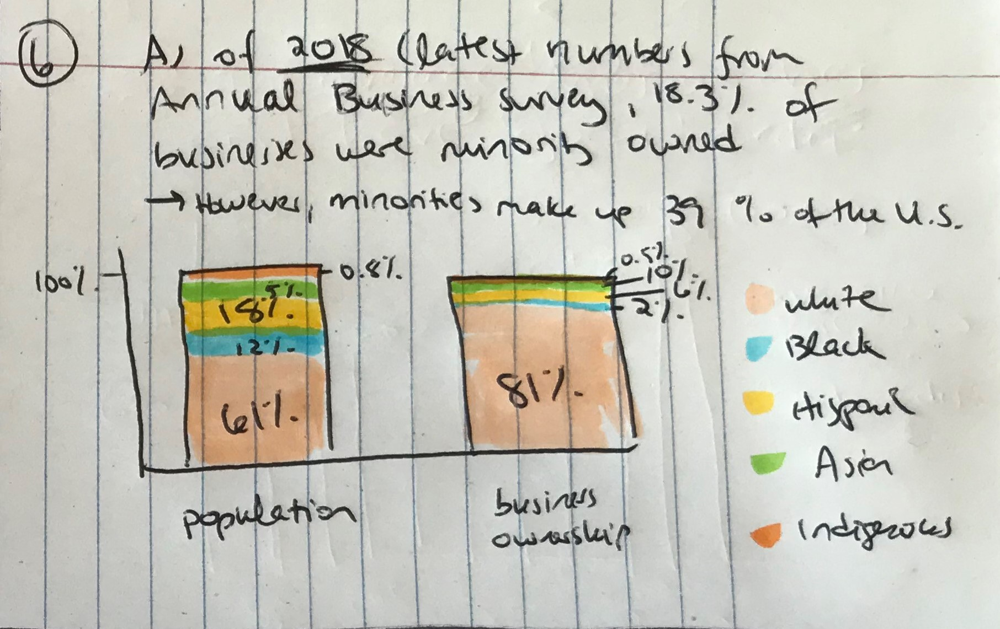

#### Sketch 7
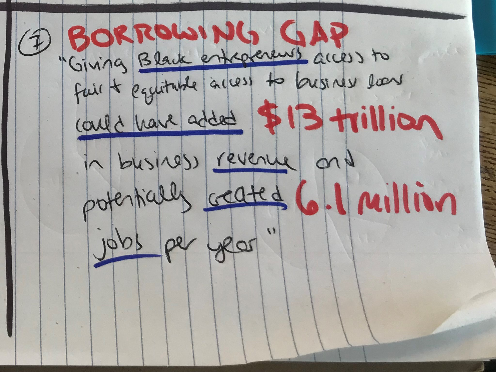

I decided not to include sketch 8

### Analysis - how factors unrelated to small business success pull down credit scores
#### Sketch 9
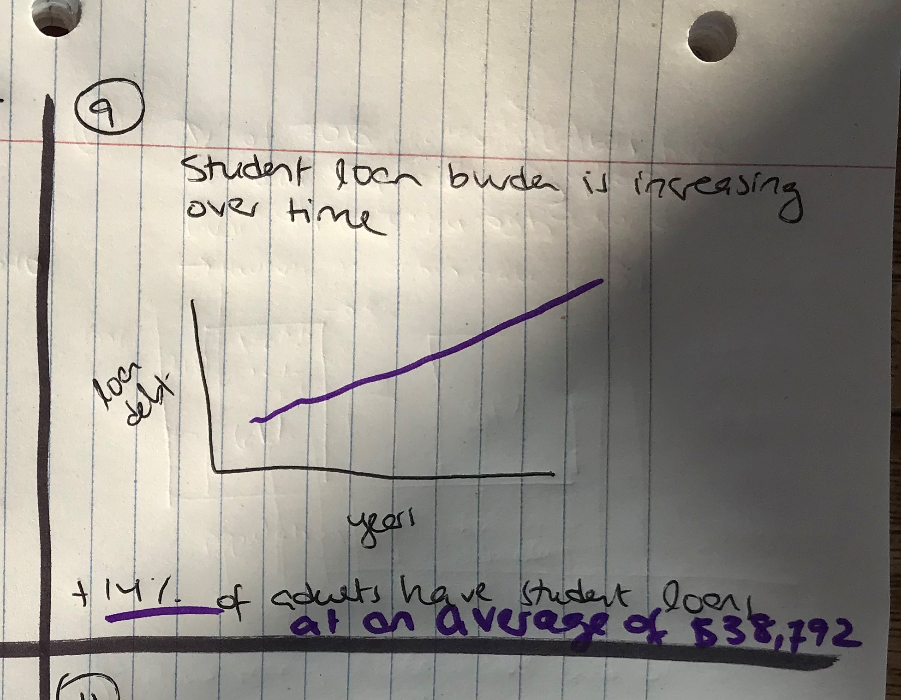

#### Sketch 10
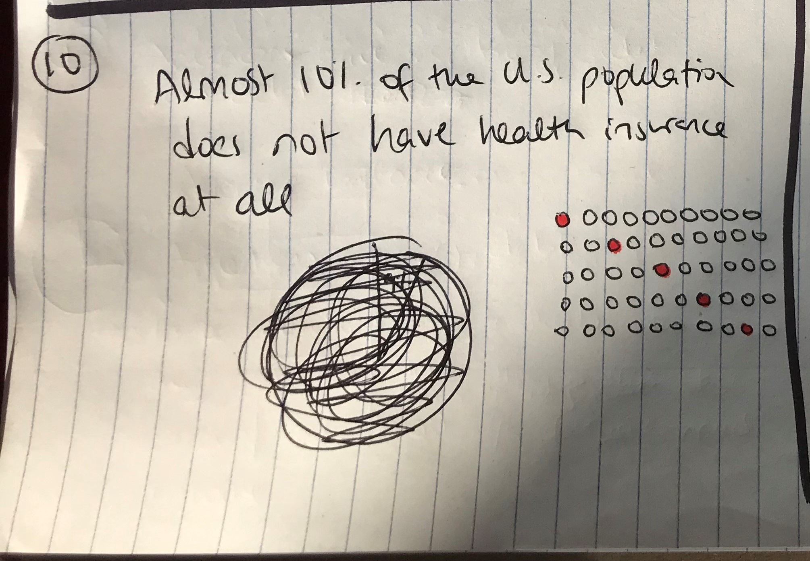

#### Sketch 11
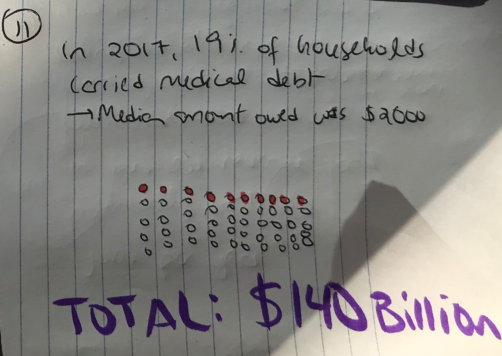

#### Sketch 12
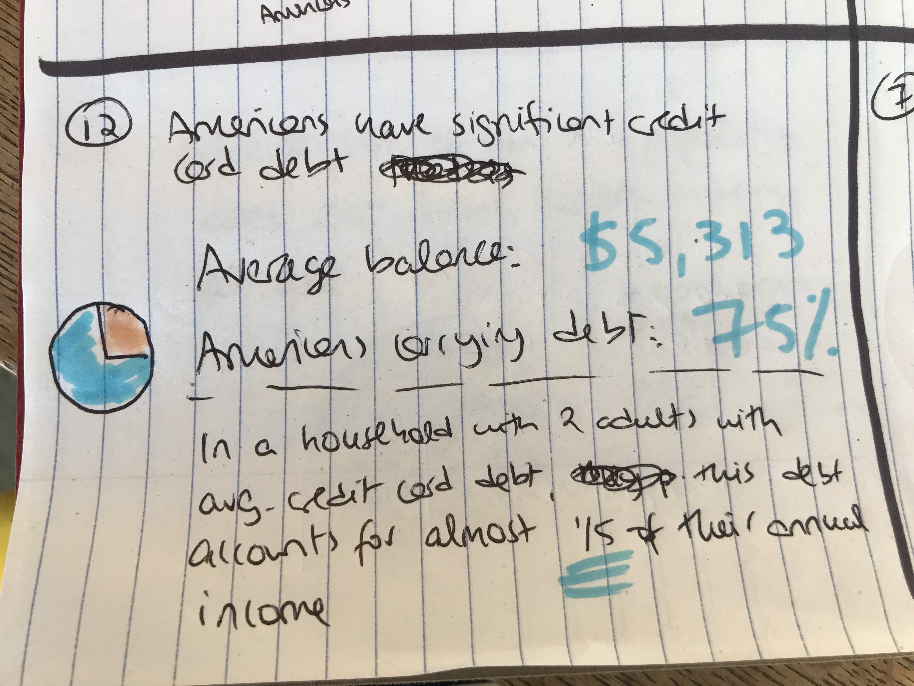

## The data
I have recreated the datasets that I will be using in [this Excel document](/Data for final project.xlsx).

Telling this particular story about credit scores requires a variety of data from different sources. Each tab in the Excel document represents a different visualization and includes the data needed to create the visualization, along withe the source(s). All of the data is publicly available.

I followed a specific process when finding the data I needed for the visualizations. First, I began by storyboarding - I developed the narrative and identified which types of data would be needed. For instance, in the introduction, I knew that I wanted to look into credit score components, credit score breakdowns by different categories of Americans (such as generation and race), and other important baseline information about credit scores that would be important for the audience to know.

Next, I spent time doing extensive research and data exploration to understand the story and make sure the data reflected what I expected. There were a few types of sources that I found most helpful: credit score companies or experts (e.g., Experian, Capital One), census data and other consumer data collected by the government, and relevant news articles highlighting specific topics (such as the number of uninsured Americans or student loan debt).

Overall, I am satisfied with the data I was able to find and I am confident that I will be able to create the visualizations I sketched in the previous section. Most of the data was pulled directly out of articles and tables from the various sources, and some basic calculations were completed to make the Census data usable (e.g., accounting for the Latinx population by cross referencing statistics on race and ethnicity). The data was fairly easily obtained and luckily does not require cleaning and interpretting large spreadsheets.

## Method & medium
I plan on using Shorthand to create my final project. There are several benefits to me using Shorthand for this project. First, Shorthand will lend itself well to storytelling, only requiring audiences to scroll down, not click through several pages. This will allow the audience to clearly follow the thread of the story. Second, Shorthand fills the function of both presentation and detailed report. During the presentation, I will be able to scroll through the narrative and pause on different visualizations, without overwhelming or distracting the audience. However, it also allows for paragraphs of information to be built out, so if someone is reading through the project, they are able to receive enough detailed analysis. Third, Shorthand allows for easy integration of visualizations (including interactive and animated visualizations). Finally, Shorthand is a new tool for me, so I am excited to develop a new skillset.

I will use Flourish and Tableau to create the visualizations themselves. Based on the exercises completed with the homeworks and in class, I believe that both tools will allow me to create the visualizations that I sketched, and enable me to make tweaks to color and other design choices to make the visualizations as effective as possible. I do not foresee using any other tools when creating my final project.
